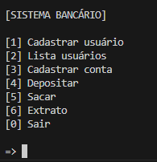

# DIO_sistema_bancario_python
Desafio:Versão 2 do sistema bancário do desafio da DIO, contendo criação de usuário e contas para usuários, além de permitir listar todos os usuários

## Como rodar e operações
- Apenas rode o script com "python sistBanc.py" deve abrir como a imagem seguinte:

