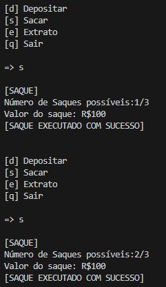

# DIO_sistema_bancario_python
Desafio: Simples sistema bancário do desafio da DIO
## Como rodar e operações
- Apenas rode o script com "python sistBanc.py"
- Deposito:
  
  
  
- Saque:
  
  
  
- Extrato:
  
  
